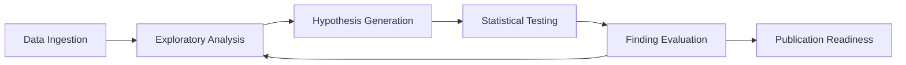
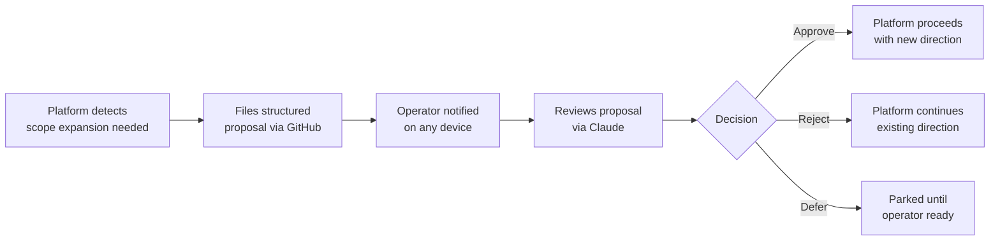
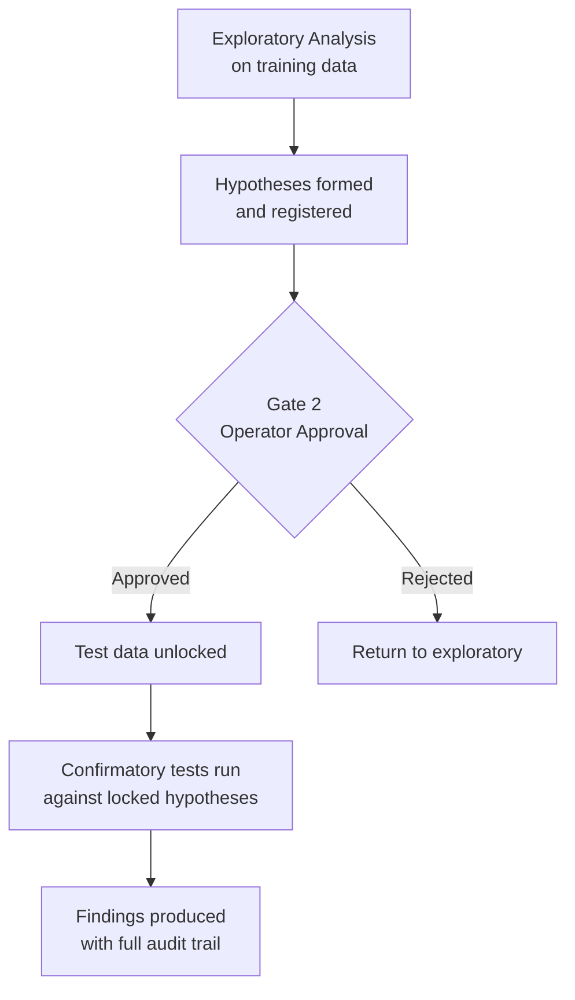

# HC-GRC — A Plain Language Guide

Cybersecurity frameworks are the foundation of how organizations decide what controls to implement, how to measure compliance, and how to defend against risk. Billions of dollars in security spending flow from the decisions those frameworks inform.

Nobody has ever tested whether the foundations are correct.

This project does that — empirically, rigorously, at scale — and builds the infrastructure to keep doing it across every major framework in the industry.

---

## The Problem

The Secure Controls Framework (SCF) is one of the most comprehensive cybersecurity frameworks ever built. It maps 1,400+ security controls across 33 domains to over 200 laws, regulations, and other frameworks through approximately 280,000 expert-assigned relationship mappings.

Those relationships — which controls are equivalent, which ones overlap, which ones cover the other — were created by domain experts. They have never been independently validated. They are treated as ground truth throughout the industry.

What if they are systematically wrong in certain areas? What if controls that experts called "equivalent" are actually saying different things? What if there are entire risk categories that no major framework adequately covers?

These are not hypothetical concerns. They are testable questions. This project tests them.

---

## How It Works

### 1. It Runs Itself

The platform is an autonomous research system. Once it starts, it analyzes data, generates hypotheses, runs statistical tests, evaluates its own findings, and iterates — continuously, without requiring day-to-day human involvement.

Think of it less like a tool and more like a research team that never sleeps, never loses focus, and documents everything it does.

The cycle repeats. Each pass makes the findings sharper.

---

### 2. The Operator Stays in Control

Autonomy does not mean unsupervised. The platform distinguishes between two types of decisions:

**Decisions the platform makes on its own** — anything within the current approved research direction. New analytical angles, refined hypotheses, variations on approved methods. The platform proceeds without asking.

**Decisions that require operator approval** — any time the platform wants to expand into new territory. New subject areas. Substantially different methods. New data sources. These require explicit sign-off before the platform proceeds.

When operator approval is needed, the platform files a structured proposal. The operator reviews it via Claude on any device — phone, tablet, laptop — and responds with approve, reject, or defer. The platform waits. It never expands its own scope without permission.

The operator governs direction. The platform handles execution.

---

### 3. The Findings Are Trustworthy

Research integrity is structural, not procedural. The platform enforces it through five human-approved checkpoints — gates — at critical transitions in the research lifecycle.

The most important gate sits between exploratory analysis and confirmatory testing. Before the platform ever runs a confirmatory statistical test, the test data is locked away in a separate partition it cannot access. The platform forms its hypotheses using only the exploratory data. Then — and only then — does the gate open, the test data becomes accessible, and the confirmatory tests run.

This means the platform cannot — architecturally cannot — look at the answer before committing to the question. Every finding traces back to a timestamped, cryptographically signed pre-registration record that proves the hypothesis existed before the test ran.

The integrity model is the same one clinical trials use. The analysis is pre-registered before the test runs. There is no way to retrofit the hypothesis to fit the result.

---

## The Research Program

This project is the first of three tiers.

**Tier 1 — Framework Science (this project)**

Empirical characterization of the SCF. Do the expert-assigned control relationships hold up under independent computational analysis? Where do they diverge, and what does that divergence mean? What is the actual semantic structure of the control space — not the editorial structure the framework authors intended, but the structure the data reveals?

Each major framework gets its own independent study. The SCF is first.

**Tier 2 — Cross-Framework Synthesis (future)**

Once multiple frameworks have been independently characterized, the comparative questions become answerable. Which controls are genuinely load-bearing across the entire industry — present in every framework, semantically consistent, empirically validated? Which risk categories are addressed by everyone, and which are quietly ignored? Where does the GRC landscape converge, and where does it only appear to?

**Tier 3 — Organizational Impact Modeling (future)**

The commercially significant tier. Takes the empirically validated framework relationships and models them against real organizational data to answer the question every board wants answered: which control failures actually drive financial losses, and by how much? This is what actuaries do for insurance. It has never been done for cybersecurity controls grounded in empirically proven framework relationships.

---

## What This Produces

The platform produces findings in three categories, with every finding labeled by how it was generated and how much confidence it warrants:

**Structural characterization** — the actual semantic organization of the SCF control space. Which controls cluster together naturally. Which clusters map to the editorial domains and which do not. Where the framework's organizational choices diverge from the data's natural structure.

**Mapping validation** — which of the 280,000 expert-assigned STRM relationships hold up under computational analysis, which do not, and where the divergence is largest. This is the first empirical test of the SCF's core claim.

**Coverage analysis** — which of the 39 SCF risk categories are well-served by standard framework portfolios, and which are systematically underrepresented. Including a specific analysis of how AI governance controls cluster across the entire framework — not just within the AI domain.

All findings carry confidence intervals. Null results are reported with the same rigor as positive findings. Nothing is swept under the rug.

---

## Status

The platform design is complete. The research protocol is locked. The agent library — 48 specialized agents organized into 17 teams — is fully specified.

Platform testing begins next. Before any real data enters the system, the platform runs a complete test cycle with synthetic data to verify that every gate fires correctly, every checkpoint records reliably, and the governance loop works end to end.

Data acquisition and analysis follow.

---

## For Technical Readers

The full technical documentation is in [`README.md`](README.md) and [`docs/`](docs/).
